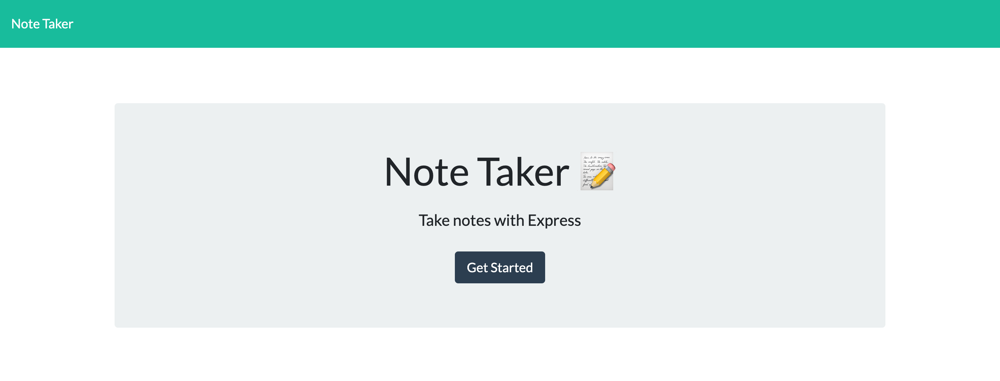
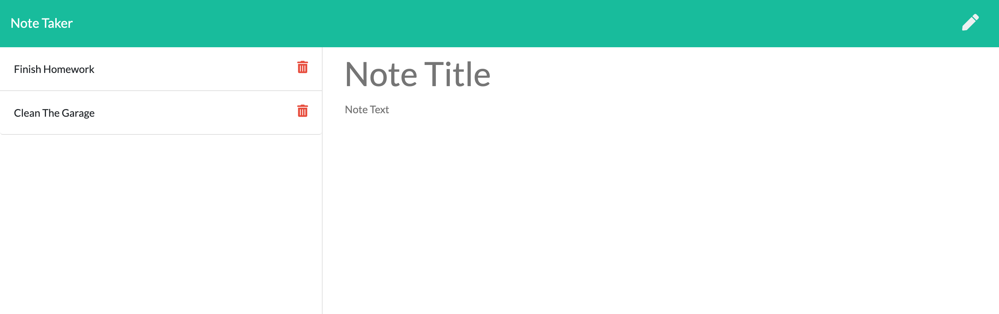

# Note Taker APP

An app that allows you to make notes and save notes.

## Table of Contents

- [Installation](#installation)
- [Usage](#usage)
- [Built With](<#built\ with>)
- [Authors](#authors)
- [License](#license)
- [Screenshots](#screenshots)

## Installation

A step by step series of examples that tell you how to get a development env running.

```cli
npm dev
```

For deployment.

```cli
npm start
```

## Usage

For development environment using nodemon.

```cli
npm start:Dev
```

## Built With

- [Express](https://www.npmjs.com/package/inquirer) - Fast, unopinionated, minimalist web framework for Node.js
- [Jquery](https://jquery.com/) - jQuery is a fast, small, and feature-rich JavaScript library.

## Authors

- **Tylor Kolbeck**

## License

This project is licensed under the MIT License - see the [LICENSE.md](LICENSE.md) file for details

## Screenshots



